# Azure DevOps TestPlans - Hands-on Lab Script

Mark Harrison : 26 March 2020

- [Part 1 - Create Project / Application](testplans-1.md)
- [Part 2 - Development](testplans-2.md) ... this document
- [Part 3 - Test Plans](testplans-3.md)

## Development

In this section we will make a code change to address the task work items - this section is optional for those only interested in testing.

### Allocate Developers

- Assign the Tasks to the Developer

- In the User Story, create a branch for the development tasks related to this story

### Visual Studio set up

Using Visual Studio

- Connect to the Azure DevOps Project

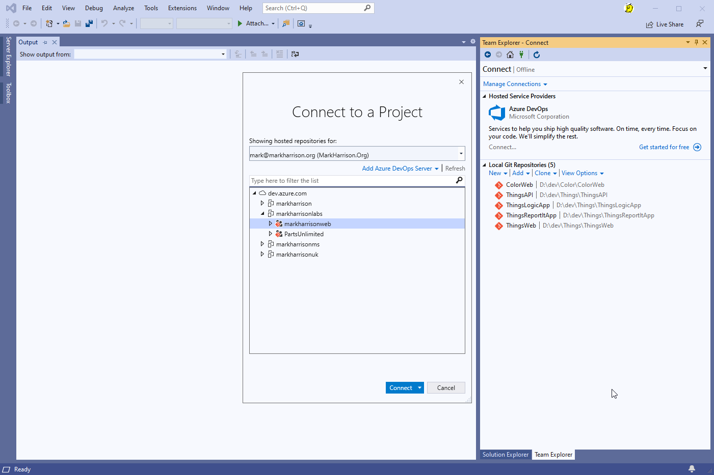

- Clone project Repo to desktop

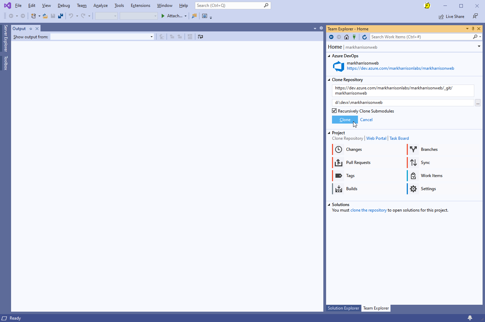

- Switch view to open application project

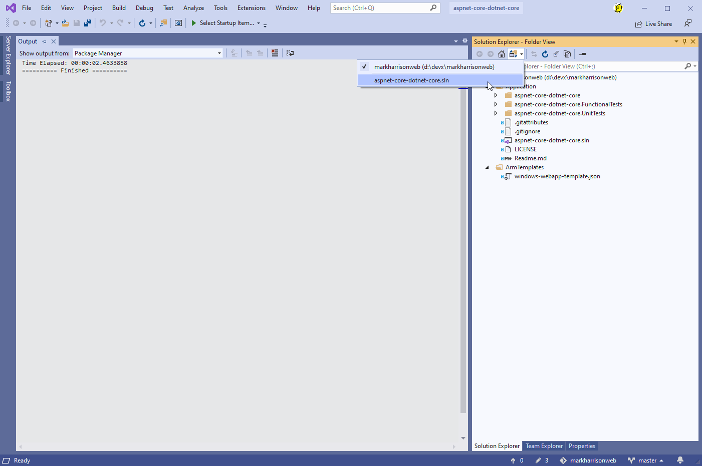

- Get branch related to Story

- Make sure editing this branch locally - it will be in bold font

### Developer Coding

- Make a change to the home page welcome message - this is in the /Pages/Index.cshtml file

- Make a change to the stylesheet - for example, change the background color ... this file is located in /wwwroot/css/site.css

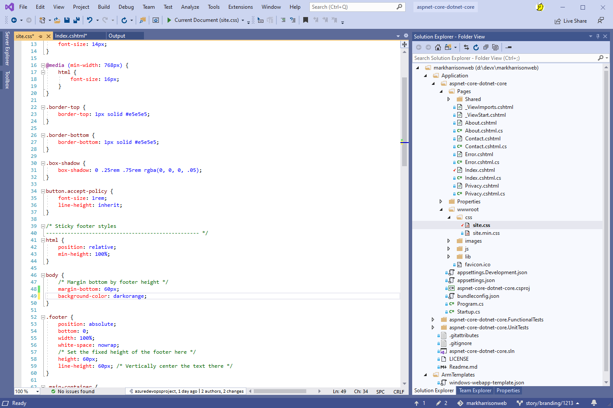

- Check locally the code works - will need to set the default startup project to be the web application

- Copy the .GitIgnore file from the Application folder to the level above .. to stop some of the Visual Studio configuration being uploaded into the Repo

### Upload changes to Repo

- In Team Explorer, select the Changes view
- Make sure branch is correct ... not the master
- Enter Commit message
- Enter Workitem Ids for the Story and Tasks
- Commit all changes

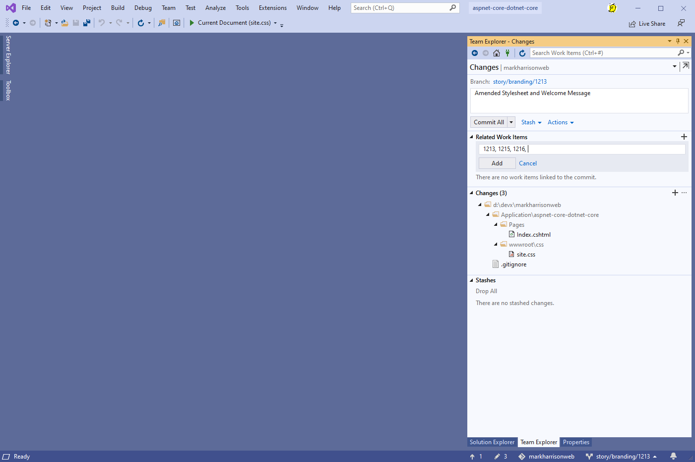

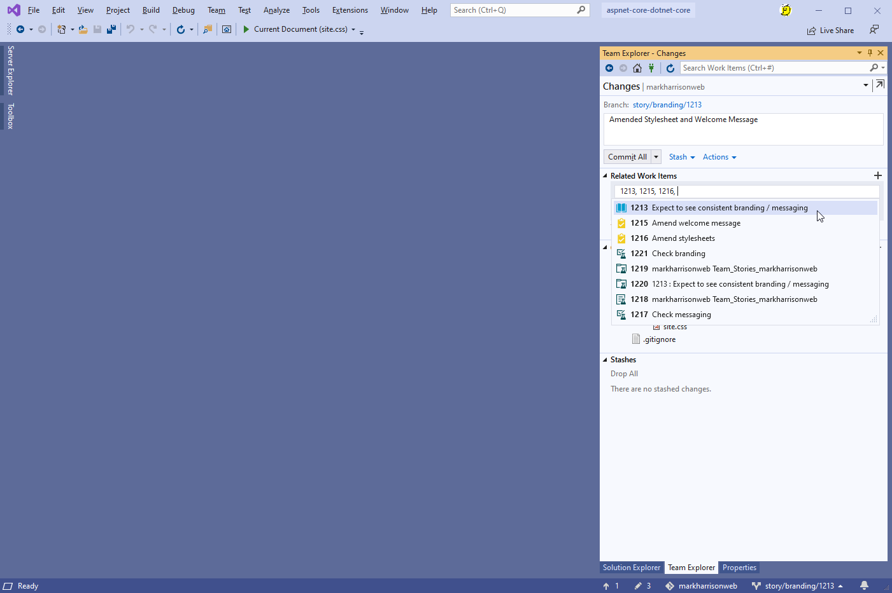

- Sync

- Push

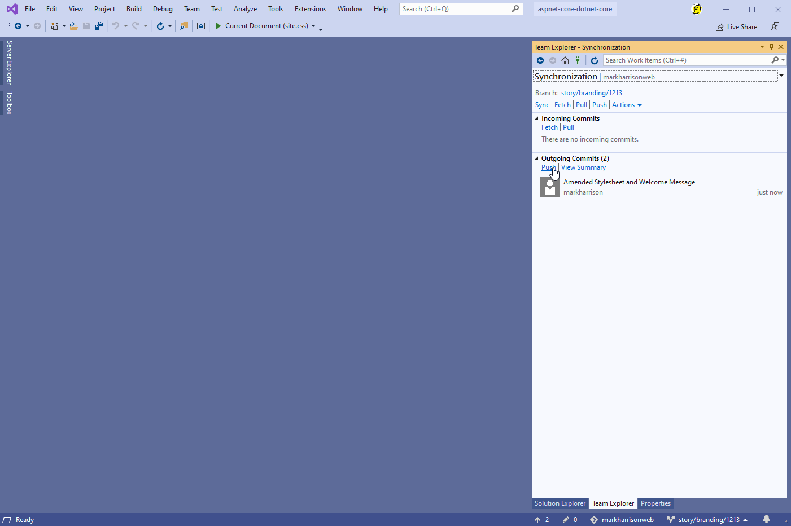

Repo in Azure DevOps has code changes

### Pipelines Build & Deploy

The build pipeline default configuration is to only start when changes to the master are detected.

- Select  [Queue] a Build

- Specify the branch for the Story that has been worked on

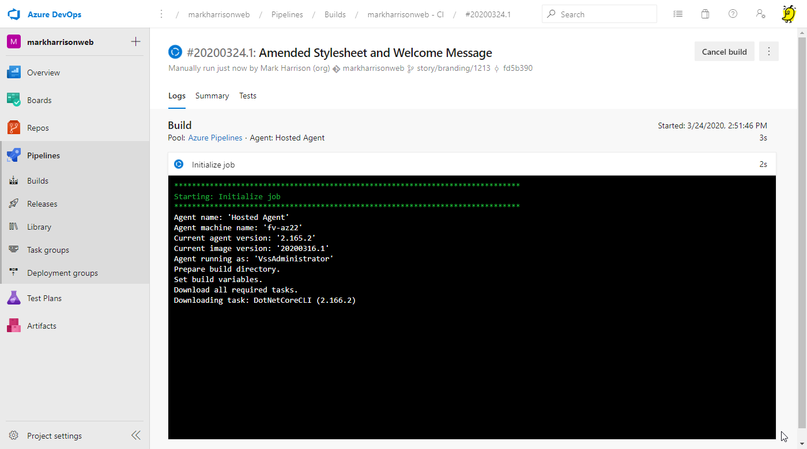

Once the Build pipeline has completed, the Release pipeline is started.

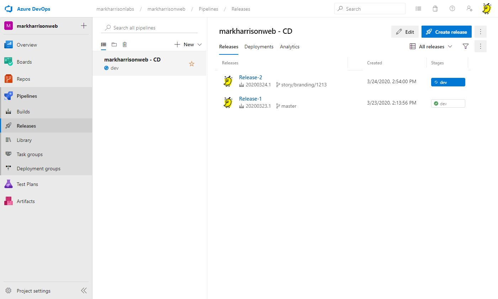

Check the updated App has been deployed to the Dev environment

### Do Manual Testing

At this stage - we should do our manual testing ... see the [Next](testplans-3.md) part of the lab.

This remaining section of this part of the lab assumes that testing has been completed and no issues are outstanding.

### Merge Code changes to Master

Create a Pull Request to merge the code into the master branch

- The Pull Request is now approved.

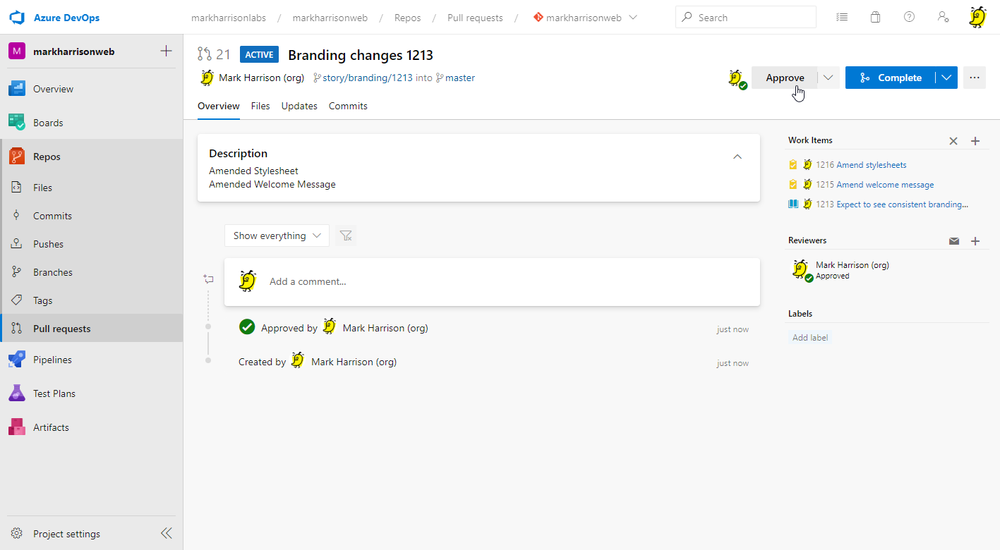

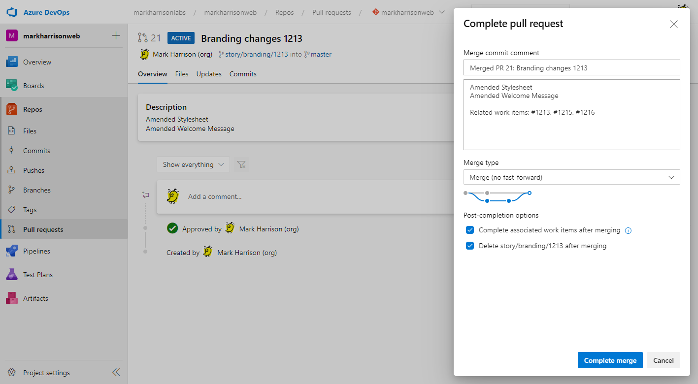

The Story branch has now been merged with the master branch - and the Story branch is then deleted.

The master branch being updated will kick off the Build and Release pipelines.

If we check in the User Story work item, we can see it has been updated with Deployment information showing was deployed to Development

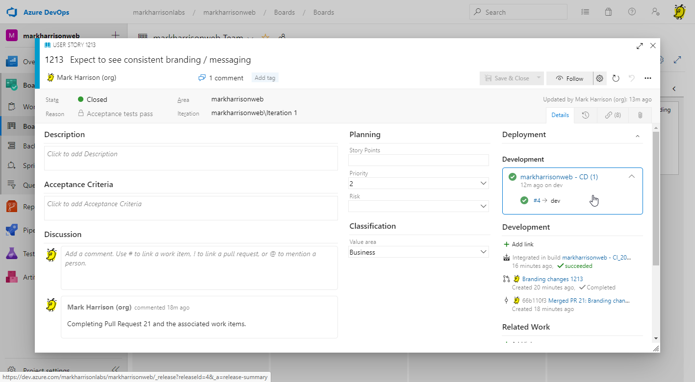

## Summary

In this section we made some development changes - and commited the work back to the Repos, and the application was deployed.

In the next section we shall take on the persona of a tester, and validate that the development did what was required and meets the Test Cases.

---
[Home](README.md) | [Prev](testplans-1.md) | [Next](testplans-3.md)
